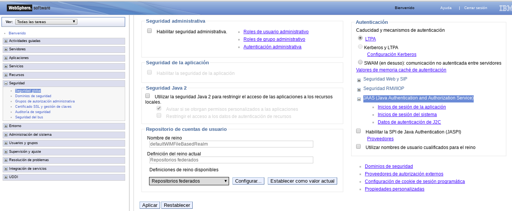
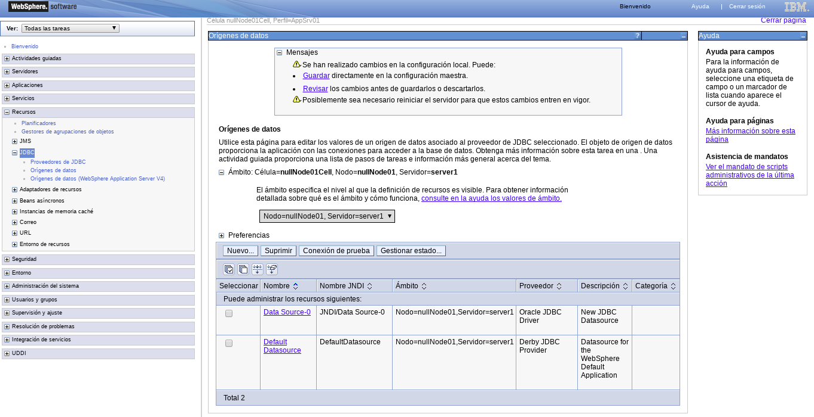
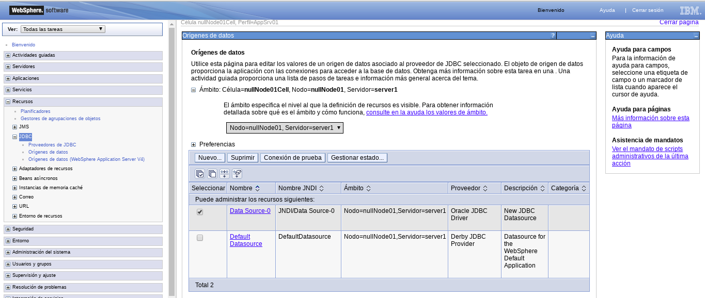

Crear un Datasource de Oracle
=============================

Esta actividad se divide en cuatro partes:

* Crear un Authentication alias.
* Crear el JDBC provider.
* Crear el Data Source.
* Hacer el Test Connections.

Crear un Authentication alias.
+++++++++++++++++++++++++++++

Nos vamos a Seguridad 

Seguridad global

JAAS (Java Authentication and Authorization Service) y Datos de autenticación de J2C

Nuevo

.. figure:: ../images/43.png

Aqui debe ser un usuario y clave validad de la base de datos de Oracle.

Guardamos.

Aplicamos.

Crear el JDBC provider.
+++++++++++++++++++++++

Nos vamos a Recursos.

JDBC, Proveedores de JDBC

Especificamos el ambito y le damos nuevo

Cargamos todos los datos que nos piden

Debemos tener el **ojdbc6.jar** y lo podemos descargar de http://www.oracle.com/technetwork/apps-tech/jdbc-112010-090769.html
Lo debemos tener en una ruta del servidor, ejemplo /opt/IBM/Oracle/ojdbc6.jar

Nos da el resumen

Guardamos.

Crear el Data Source.
++++++++++++++++++++++++

Nos vamos a Recursos, JDBC y Origen de datos.

Seleccionamos el Ambito y le damos Nuevo.

.. figure:: ../images/55.png

Colocamos los nombres del JDBC y JNDI

Seleccionamos nuestro Driver.

Colocamos nuestra URL jdbc:oracle:thin:@//192.168.56.53:1521/bd12c

Seleccionamos el Authentication alias que creamos

El Resumen.

Guardamos.

Hacer el Test Connections
++++++++++++++++++++++++++

Y debemos ver que se ejecuto con exito.

