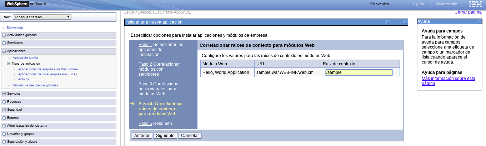
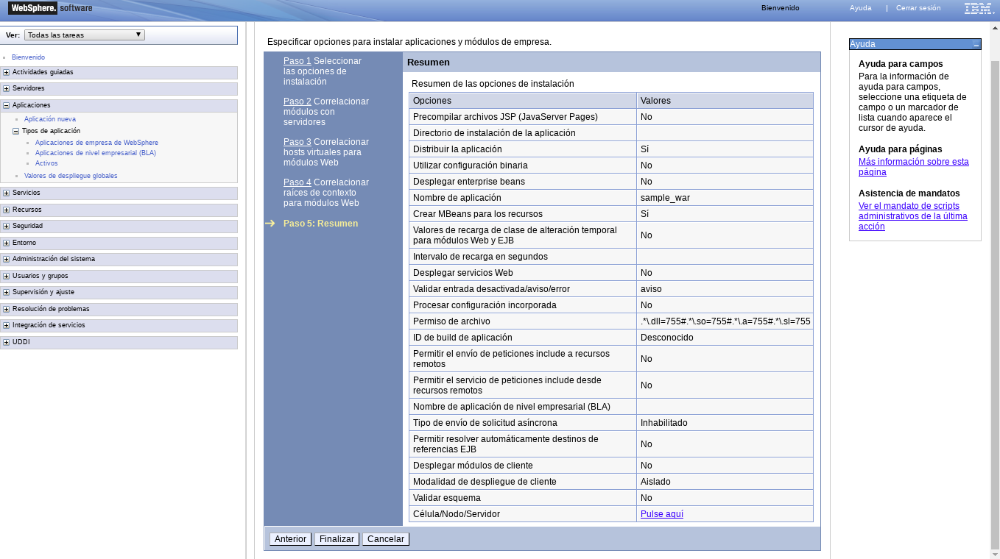

Desplegar una Aplicacion en IBM WebSphere Application Server
============================================================

Vamos a desplegar un WAR. En script tenemos un war de ejemplo.

Nos vamos a Aplicaciones, Tipos de aplicación, Aplicaciones de empresa de WebSphere y le damos instalar

Seleccionamos el WAR.

Seleccionamos como queremos realizar la instalacion.

Opciones de la instalacion.

Correlacionar módulos con servidores

.. figure:: ../images/69.png

Correlacionar hosts virtuales para módulos Web

Correlacionar raíces de contexto para módulos Web

Resumen

Guardamos.

Inicializamos la aplicacion.

Listo

Probamos la URL IP_SERVIDOR:9080/sample

