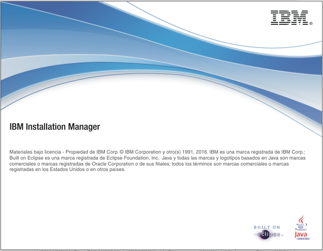
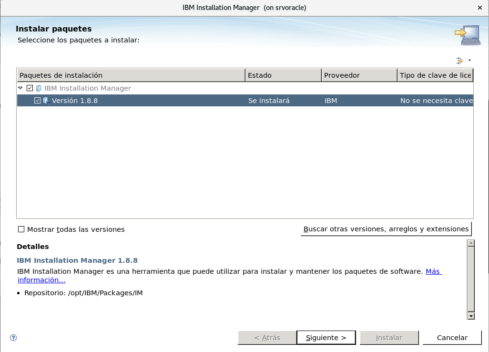
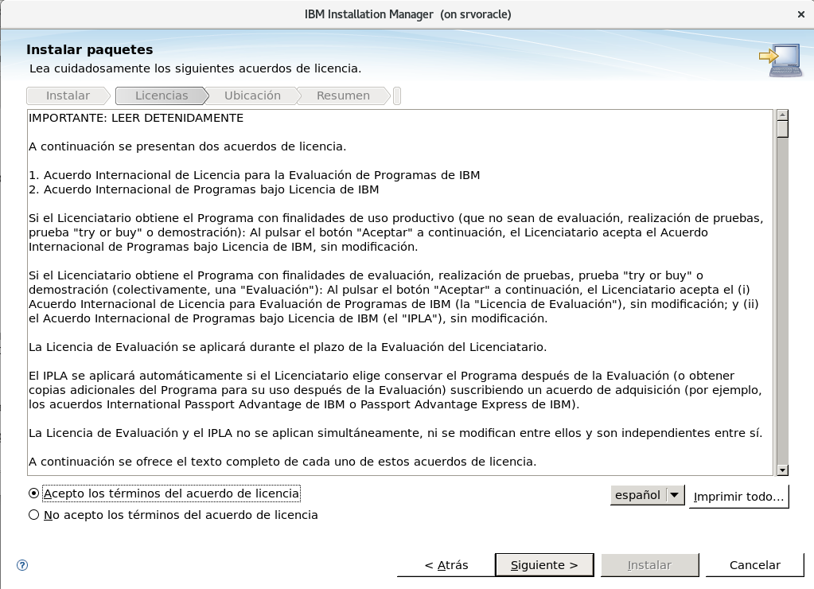
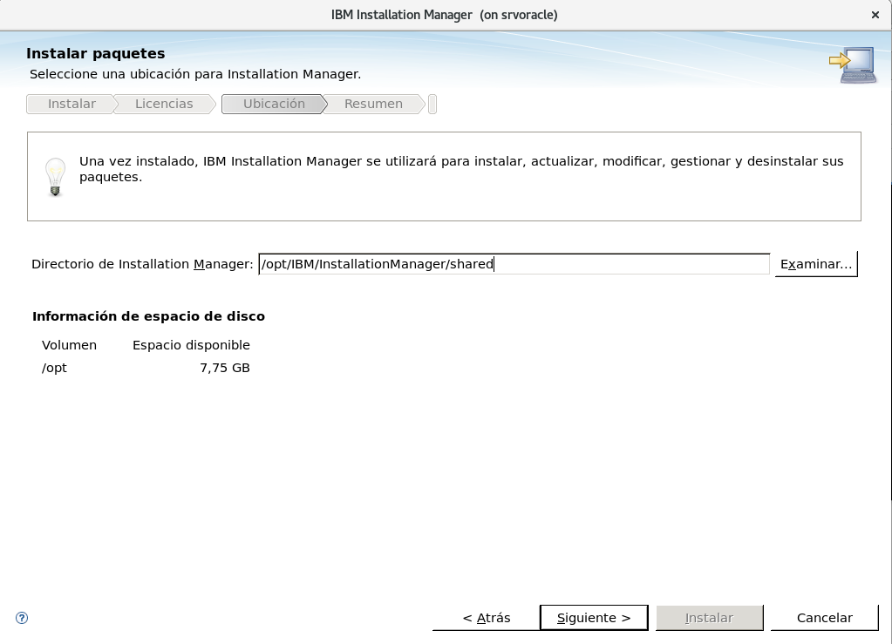
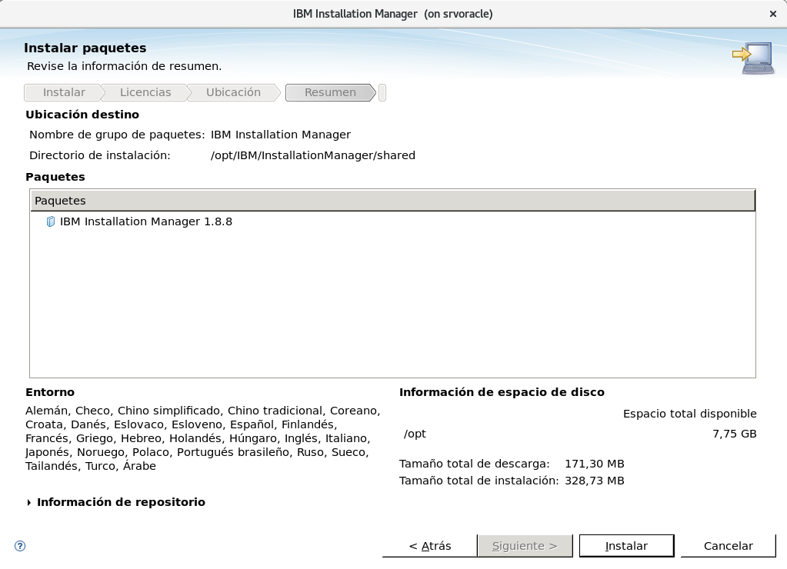
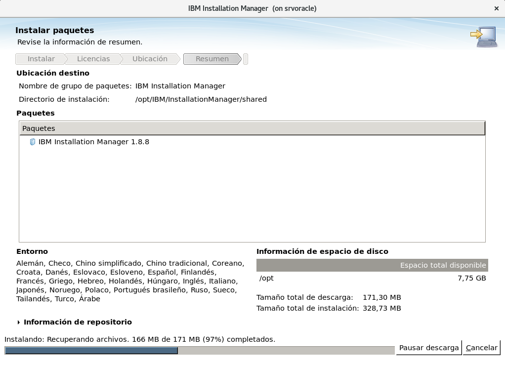
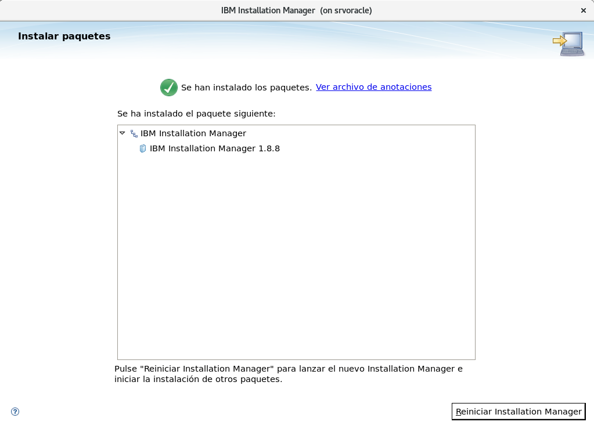
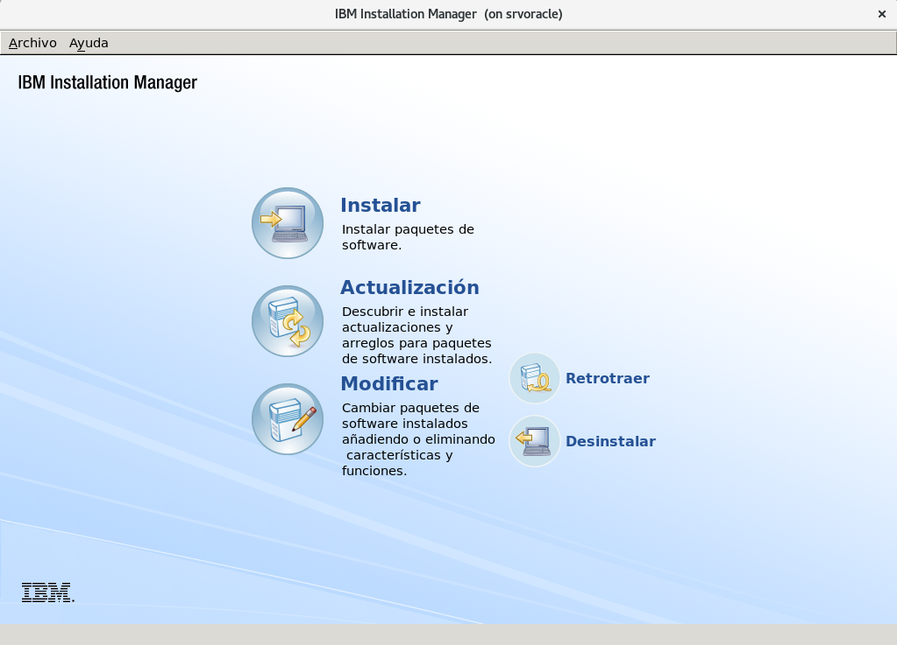

Instalar IBM IM (Installation Manager 1.8.8)
==========================================

Installation Manager es una herramienta de gestión de la instalación que tiene varias características que ahorran tiempo. Le ayudará a instalar, actualizar, modificar y desinstalar paquetes del producto en su equipo. Hace un seguimiento de lo que va a instalar y también de lo que ya ha instalado y de lo que está disponible para instalación. Busca actualizaciones para informarle de que el paquete que se propone instalar es el que tiene la versión más reciente. También proporciona herramientas para gestionar las licencias de los paquetes que instala, y para actualizar y modificar paquetes.

Descargar el IBM IM (Installation Manager 1.8.8) desde.:
http://www-01.ibm.com/support/docview.wss?uid=swg24044395

Creamos un usuario para ejecutar la instalacion.::

	# groupadd install
	# useradd oracle -g install
	# passwd oracle
	Cambiando la contraseña del usuario oracle.
	Nueva contraseña: 
	Vuelva a escribir la nueva contraseña: 
	passwd: todos los tokens de autenticación se actualizaron exitosamente.

Debemos configurar el sshd para que se pueda hacer X11 forward, motivado que vamos a requerir las X para esta instalacion.::

	# vi /etc/ssh/sshd_config
	     X11Forwarding yes

Instalamos el paquete xauth.::

	# yum install xauth xorg-x11-apps

Ingresamos nuevamente al servidor con la opcion -X.::

	$ ssh -X oracle@192.168.56.10
	oracle@192.168.56.10's password: 
	[oracle@srvoracle ~]$ 

Probamos que las X11 esten haciendo el forward, ejecutamos el xclock y debemos visuailizar esta utilidad grafica.::

	$ echo $DISPLAY
	localhost:10.0

	$ xclock

Creamos la estructura de directorios para almacenar los paquetes e instalarlos.::

	# mkdir /opt/IBM/Packages/IM
	# mkdir /opt/IBM/app
	# chown -R oracle.install /opt/IBM/

Vamos al directorio y descomprimimos el paquete de IM 1.8.::

	# cd /opt/IBM/Packages/IM
	# unzip agent.installer.linux.gtk.x86_64_1.8.8000.20171130_1105.zip

::

	$ ls
	agent.installer.linux.gtk.x86_64_1.8.8000.20171130_1105.zip  installc.ini                  repository.config
	con-disk-set-inst.sh                                         install.ini                   repository.xml
	configuration                                                install.xml                   silent-install.ini
	documentation                                                jre_7.0.100010.20170822_1251  tools
	groupinst                                                    license                       userinst
	groupinstc                                                   native                        userinstc
	groupinstc.ini                                               Offerings                     userinstc.ini
	groupinst.ini                                                p2                            userinst.ini
	install                                                      plugins                       user-silent-install.ini
	installc                                                     readme.html

Para realizar la instalacion si es con root utilizamos *install* si es con otro usuario *userinst*.::

	$ ./userinst

Y comenzamos a trabajar con la interfaz grafica.

Y para aperturar nuevamente seria con.::

	$ /opt/IBM/InstallationManager/shared/eclipse/IBMIM

Ya tenemos instalado el IBM IM (Installation Manager 1.8.8)

