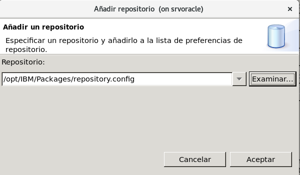
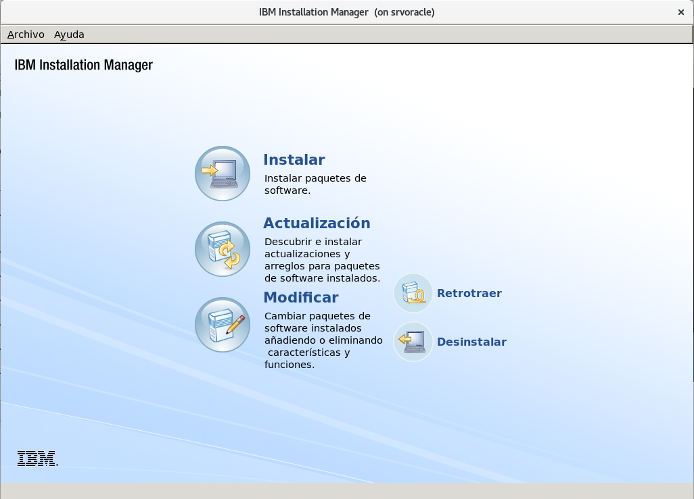
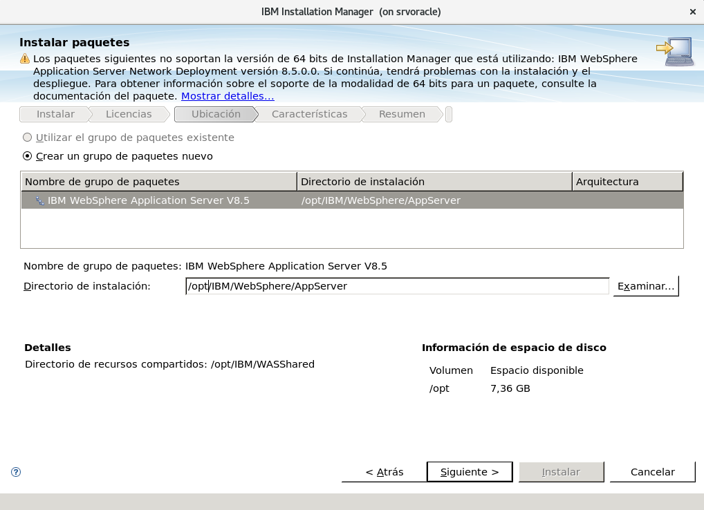

Instalar IBM WAS (Websphere Application Server 8.5)
==============================================

IBM WebSphere Application Server (WAS, servidor de aplicaciones WebSphere), un servidor de aplicaciones de software, de la familia WebSphere de IBM. WAS está construido usando estándares abiertos tales como J2EE, XML, y Servicios Web. Varios laboratorios de IBM alrededor del mundo participaron en la creación de los productos run-time WebSphere y las herramientas de desarrollo. Esto funciona con varios servidores web incluyendo Apache HTTP Server, Netscape Enterprise Server, Microsoft Internet Information Services (IIS), IBM HTTP Server para i5/OS, IBM HTTP Server para z/OS, y también IBM HTTP Server para el sistema operativo AIX/Linux/Microsoft Windows/Solaris.

Descargar el IBM WAS (Websphere Application Server) desde.:
https://www.ibm.com/us-en/marketplace/websphere-family-edition

* WAS_ND_V8.5_1_OF_3.zip  
* WAS_ND_V8.5_2_OF_3.zip  
* WAS_ND_V8.5_3_OF_3.zip

Vamos al directorio y descomprimimos los paquetes WAS 8.5.::

	s cd /opt/IBM/Packages/
	$ unzip WAS_ND_V8.5_1_OF_3.zip
	$ unzip WAS_ND_V8.5_2_OF_3.zip
	$ unzip WAS_ND_V8.5_3_OF_3.zip

Listamos el contenido descomprimido.::

	$ ls 
	Copyright.txt  disk2  IM       readme                              repository.config  WLP
	disk1          disk3  lafiles  Remote_Installation_Tool_for_IBM_i  responsefiles

Debemos tener instalado IBM IM (Installation Manager 1.8.8) y lo ejecutamos.::

	$ /opt/IBM/InstallationManager/shared/eclipse/IBMIM

.. figure:: ../images/22.png

Cuando culmine levanta de forma automatica el *Websphere Customization Toolbox*

.. figure:: ../images/31.png

Si quiere desde aqui inicia el WAS, pero nosotros lo vamos iniciar por bash.

Listamos los directorios.::

	$ ls
	InstallationManager  Packages  WASShared  WebSphere

	$ ls WASShared/
	atoc  extra  files  native  repository.config

	$ ls WebSphere/
	AppServer

	$ ls WebSphere/AppServer/
	bin            etc                  instutils  optionalLibraries  sar2war_tool     tivoli
	configuration  features             java       plugins            Scheduler        UDDIReg
	deploytool     firststeps           lafiles    profiles           scriptLibraries  uninstall
	derby          installableApps      lib        profileTemplates   systemApps       universalDriver
	dev            installedConnectors  links      properties         temp             util
	endorsed_apis  installedFilters     logs       runtimes           tio              web

	$ ls WebSphere/AppServer/profiles/
	AppSrv01

	$ ls WebSphere/AppServer/profiles/AppSrv01/
	bin     configuration  expandedBundles  installableApps  installedConnectors  logs        servers  workspace
	config  etc            firststeps       installedApps    installedFilters     properties  temp     wstemp

	$ ls WebSphere/AppServer/profiles/AppSrv01/servers/
	server1

Editamos el hosts.::

	# vi /etc/hosts
	127.0.0.1   localhost localhost.localdomain localhost4 localhost4.localdomain4 srvoracle

Iniciamos el WAS por bash.::

	$ /opt/IBM/WebSphere/AppServer/profiles/AppSrv01/bin/startServer.sh server1
	ADMU0116I: La información de la herramienta se está anotando en el archivo
		   /opt/IBM/WebSphere/AppServer/profiles/AppSrv01/logs/server1/startServer.log
	ADMU0128I: Iniciando herramienta con el perfil AppSrv01
	ADMU3100I: Leyendo la configuración para el servidor: server1
	ADMU3200I: El servidor se ha iniciado. Esperando el estado de inicialización.
	ADMU3000I: Servidor server1 abierto para e-business; el ID de proceso es 6139

Listamos los puertos.::

	$ netstat -natp | grep -i listen
	(Not all processes could be identified, non-owned process info
	 will not be shown, you would have to be root to see it all.)
	tcp        0      0 127.0.0.1:25                0.0.0.0:*                   LISTEN      -                   
	tcp        0      0 127.0.0.1:6010              0.0.0.0:*                   LISTEN      -                   
	tcp        0      0 127.0.0.1:6011              0.0.0.0:*                   LISTEN      -                   
	tcp        0      0 0.0.0.0:111                 0.0.0.0:*                   LISTEN      -                   
	tcp        0      0 0.0.0.0:48658               0.0.0.0:*                   LISTEN      -                   
	tcp        0      0 0.0.0.0:22                  0.0.0.0:*                   LISTEN      -                   
	tcp        0      0 127.0.0.1:631               0.0.0.0:*                   LISTEN      -                   
	tcp        0      0 :::2809                     :::*                        LISTEN      6139/java           
	tcp        0      0 ::1:25                      :::*                        LISTEN      -                   
	tcp        0      0 :::9402                     :::*                        LISTEN      6139/java           
	tcp        0      0 ::1:6010                    :::*                        LISTEN      -                   
	tcp        0      0 :::9403                     :::*                        LISTEN      6139/java           
	tcp        0      0 ::1:6011                    :::*                        LISTEN      -                   
	tcp        0      0 ::ffff:127.0.0.1:9633       :::*                        LISTEN      6139/java           
	tcp        0      0 :::41889                    :::*                        LISTEN      -                   
	tcp        0      0 :::9443                     :::*                        LISTEN      6139/java           
	tcp        0      0 :::9060                     :::*                        LISTEN      6139/java           
	tcp        0      0 :::9100                     :::*                        LISTEN      6139/java           
	tcp        0      0 :::111                      :::*                        LISTEN      -                   
	tcp        0      0 :::8880                     :::*                        LISTEN      6139/java           
	tcp        0      0 :::9043                     :::*                        LISTEN      6139/java           
	tcp        0      0 :::22                       :::*                        LISTEN      -                   
	tcp        0      0 ::1:631                     :::*                        LISTEN      -                   
	tcp        0      0 :::9080                     :::*                        LISTEN      6139/java 

Nos conectamos a la consola http://192.168.56.10:9060/ibm/console.:

Para detenerlo.::

	$ /opt/IBM/WebSphere/AppServer/profiles/AppSrv01/bin/stopServer.sh server1
	ADMU0116I: La información de la herramienta se está anotando en el archivo
		   /opt/IBM/WebSphere/AppServer/profiles/AppSrv01/logs/server1/stopServer.log
	ADMU0128I: Iniciando herramienta con el perfil AppSrv01
	ADMU3100I: Leyendo la configuración para el servidor: server1
	ADMU3201I: Se ha emitido una petición de detención del servidor. Esperando el
		   estado de detención.
	ADMU4000I: La detención del servidor server1 ha finalizado.

